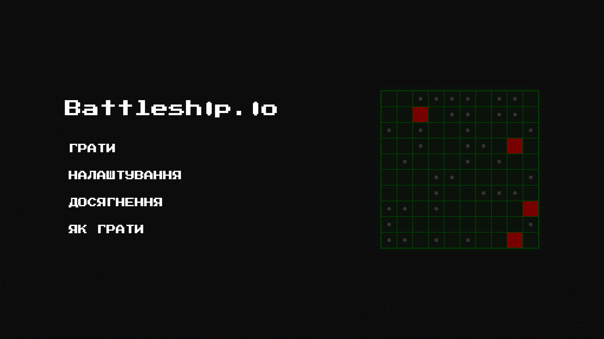
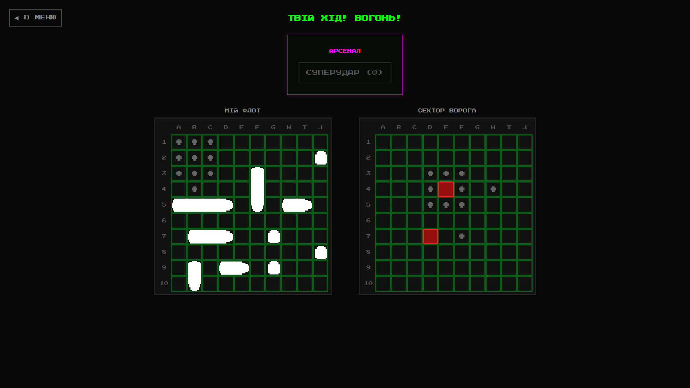

# BATTLESHIP_UCUP-_ReturnZero
Battleship 

Опис проєкту
Веб-реалізація класичної гри "Морський бій" з розширеним функціоналом, ретро-стилізацією та клієнт-серверною архітектурою на базі WebSockets для багатокористувацької гри в реальному часі.

Інструкція з запуску
Проєкт використовує Python (FastAPI) для серверної частини та HTML/CSS/JS для клієнтської. Для запуску доступні два способи.

Спосіб 1: Автоматичний запуск (Рекомендовано для Windows)
Переконайтеся, що в системі встановлено Python 3.8+.

Знайдіть у кореневій папці проєкту файл start.bat і двічі клікніть на нього.

Скрипт автоматично перевірить наявність Python, створить віртуальне середовище, встановить необхідні бібліотеки (fastapi, uvicorn, websockets), запустить сервер і відкриє гру у браузері за замовчуванням.

Спосіб 2: Ручний запуск (У разі помилки батніка або для MacOS/Linux)
Відкрийте термінал (командний рядок) у кореневій директорії проєкту.

Встановіть необхідні залежності командою:

Bash
pip install fastapi uvicorn websockets
Перейдіть до папки бекенду та запустіть сервер:

Bash
cd backend
uvicorn main:app --host 0.0.0.0 --port 8000
Відкрийте веб-браузер та перейдіть за адресою: http://127.0.0.1:8000

Інструкція: Як грати по мережі (Мультиплеєр / PvP)
Сервер налаштований на прослуховування всіх мережевих інтерфейсів (0.0.0.0), що дозволяє іншим пристроям підключатися до гри через локальну мережу (Wi-Fi або LAN).

Кроки для створення мережевої гри:

Запуск сервера (Хост): Один з гравців запускає гру на своєму комп'ютері за інструкцією вище (Спосіб 1 або Спосіб 2).

Отримання IP-адреси: Гравець-хост повинен дізнатися свою локальну IPv4-адресу (наприклад, через команду ipconfig у консолі Windows). Адреса матиме формат, схожий на 192.168.1.X.

Підключення першого гравця: Хост відкриває гру локально, переходить в меню "Грати", вводить свій нікнейм, придумує назву кімнати у полі "СЕКТОР", обирає режим VS HUMAN та натискає "У БІЙ!".

Підключення другого гравця: Другий гравець, знаходячись у тій самій мережі, вводить у браузері IP-адресу хоста та порт. Приклад: http://192.168.1.X:8000

Синхронізація: Другий гравець також натискає "Грати", вводить свій нікнейм, і у поле "СЕКТОР" вписує абсолютно ідентичну назву кімнати, яку створив перший гравець. Далі обирає VS HUMAN і тисне "У БІЙ!".

Сервер автоматично з'єднає двох гравців у вказаному секторі, після чого розпочнеться фаза розстановки флоту.